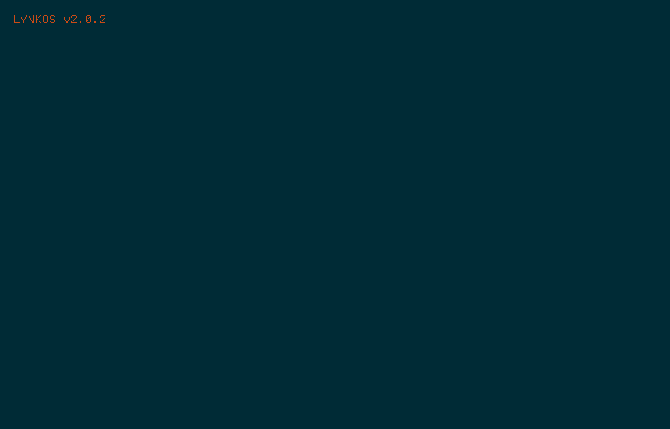

## 👋🏽&nbsp; Hey

I'm Kiran. I enjoy creating, exploring, and experimenting (among other things).

## 💻&nbsp; Skills

<!-- Languages -->

![Java](https://img.shields.io/static/v1?label=Languages&message=Java&logo=data:image/svg+xml;base64,PHN2ZyB4bWxucz0iaHR0cDovL3d3dy53My5vcmcvMjAwMC9zdmciIHZpZXdCb3g9IjAgMCAxMjggMTI4IiBmaWxsPSJ3aGl0ZSI+PHBhdGggZD0iTTQ3LjYxNyA5OC4xMnMtNC43NjcgMi43NzQgMy4zOTcgMy43MWM5Ljg5MiAxLjEzIDE0Ljk0Ny45NjggMjUuODQ1LTEuMDkyIDAgMCAyLjg3MSAxLjc5NSA2Ljg3MyAzLjM1MS0yNC40MzkgMTAuNDctNTUuMzA4LS42MDctMzYuMTE1LTUuOTY5bS0yLjk4OC0xMy42NjVzLTUuMzQ4IDMuOTU5IDIuODIzIDQuODA1YzEwLjU2NyAxLjA5MSAxOC45MSAxLjE4IDMzLjM1NC0xLjYgMCAwIDEuOTkzIDIuMDI1IDUuMTMyIDMuMTMxLTI5LjU0MiA4LjY0LTYyLjQ0Ni42OC00MS4zMDktNi4zMzZtMjUuMTczLTIzLjE4NGM2LjAyNSA2LjkzNS0xLjU4IDEzLjE3LTEuNTggMTMuMTdzMTUuMjg5LTcuODkxIDguMjY5LTE3Ljc3N2MtNi41NTktOS4yMTUtMTEuNTg3LTEzLjc5MiAxNS42MzUtMjkuNTggMCAuMDAxLTQyLjczMSAxMC42Ny0yMi4zMjQgMzQuMTg3Ii8+PHBhdGggZD0iTTEwMi4xMjMgMTA4LjIyOXMzLjUyOSAyLjkxLTMuODg4IDUuMTU5Yy0xNC4xMDIgNC4yNzItNTguNzA2IDUuNTYtNzEuMDk0LjE3MS00LjQ1MS0xLjkzOCAzLjg5OS00LjYyNSA2LjUyNi01LjE5MiAyLjczOS0uNTkzIDQuMzAzLS40ODUgNC4zMDMtLjQ4NS00Ljk1My0zLjQ4Ny0zMi4wMTMgNi44NS0xMy43NDMgOS44MTUgNDkuODIxIDguMDc2IDkwLjgxNy0zLjYzNyA3Ny44OTYtOS40NjhNNDkuOTEyIDcwLjI5NHMtMjIuNjg2IDUuMzg5LTguMDMzIDcuMzQ4YzYuMTg4LjgyOCAxOC41MTguNjM4IDMwLjAxMS0uMzI2IDkuMzktLjc4OSAxOC44MTMtMi40NzQgMTguODEzLTIuNDc0cy0zLjMwOCAxLjQxOS01LjcwNCAzLjA1M2MtMjMuMDQyIDYuMDYxLTY3LjU0NCAzLjIzOC01NC43MzEtMi45NTggMTAuODMyLTUuMjM5IDE5LjY0NC00LjY0MyAxOS42NDQtNC42NDNtNDAuNjk3IDIyLjc0N2MyMy40MjEtMTIuMTY3IDEyLjU5MS0yMy44NiA1LjAzMi0yMi4yODUtMS44NDguMzg1LTIuNjc3LjcyLTIuNjc3Ljcycy42ODgtMS4wNzkgMi0xLjU0M2MxNC45NTMtNS4yNTUgMjYuNDUxIDE1LjUwMy00LjgyMyAyMy43MjUgMC0uMDAyLjM1OS0uMzI3LjQ2OC0uNjE3TTc2LjQ5MSAxLjU4N1M4OS40NTkgMTQuNTYzIDY0LjE4OCAzNC41MWMtMjAuMjY2IDE2LjAwNi00LjYyMSAyNS4xMy0uMDA3IDM1LjU1OS0xMS44MzEtMTAuNjczLTIwLjUwOS0yMC4wNy0xNC42ODgtMjguODE1QzU4LjA0MSAyOC40MiA4MS43MjIgMjIuMTk1IDc2LjQ5MSAxLjU4NyIvPjxwYXRoIGQ9Ik01Mi4yMTQgMTI2LjAyMWMyMi40NzYgMS40MzcgNTctLjggNTcuODE3LTExLjQzNiAwIDAtMS41NzEgNC4wMzItMTguNTc3IDcuMjMxLTE5LjE4NiAzLjYxMi00Mi44NTQgMy4xOTEtNTYuODg3Ljg3NCAwIC4wMDEgMi44NzUgMi4zODEgMTcuNjQ3IDMuMzMxIi8+PC9zdmc+&color=39ae39&labelColor=393939&logoColor=white)

<!-- Tools -->

<!-- OS -->

## 📝&nbsp; Latest Blog Posts
<!-- BLOG-POST-LIST:START -->
- [The Connection Between Mulholland Drive and Dharmic Philosophy](https://blog.lynkos.dev/posts/mulholland-drive-dharmic-philosophy/)
- [Custom Storage](https://blog.lynkos.dev/posts/custom-storage/)
- [Windows Game-Specific Fixes on macOS](https://blog.lynkos.dev/posts/windows-game-fixes/)
- [How to Build and Run Optimized, Self-Compiled LLMs Locally on MacBook Pro Apple Silicon M-series](https://blog.lynkos.dev/posts/self-compiled-llm/)
- [My Blogging Setup](https://blog.lynkos.dev/posts/blogging-setup/)
<!-- BLOG-POST-LIST:END -->